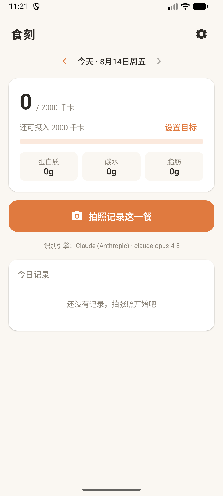
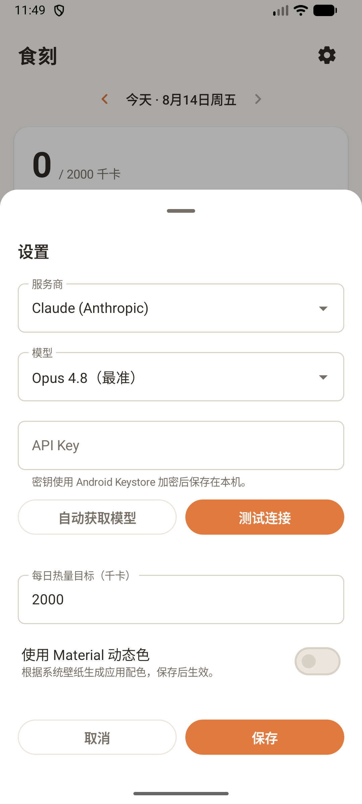
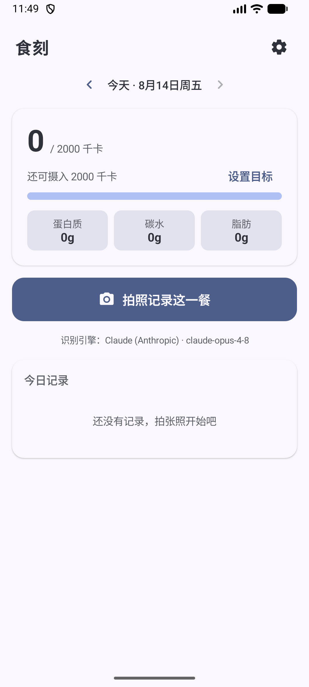

<div align="center">

# 食刻 · Shike

**拍一张，记一餐。用视觉模型把食物照片变成可追踪的热量与营养记录。**




</div>

食刻是一款纯原生 Android 食物记录 App。拍摄或选择食物照片后，App 会直接调用你选择的视觉模型，估算食物份量、热量和三大营养素，并将结果保存在设备本地。

> [!IMPORTANT]
> 食刻用于辅助记录，不替代医疗或专业营养建议。估算结果会受拍摄角度、遮挡和模型能力影响。

## 功能

- 使用系统相机或 Android Photo Picker 选择食物图片；
- 识别食物、份量、热量、蛋白质、碳水和脂肪；
- 按日期查看、补记、删除和撤销删除饮食记录；
- 设置每日热量目标，查看当天热量进度与宏量营养结构；
- 在“统计”页切换近 7 天/近 30 天，查看记录天数、餐次数、总摄入、日均摄入和热量趋势；
- 支持 Claude、OpenAI、Gemini、Kimi、Grok、Mistral、通义千问、智谱 GLM、火山方舟、MiMo、DeepSeek，以及 OpenRouter、硅基流动和自定义兼容接口；
- 原生协议优先：Claude Messages、OpenAI/xAI/方舟 Responses、Gemini generateContent；其余使用厂商官方兼容协议；
- 所有服务商的模型列表都从对应 API 实时获取，不使用本地预置型号；有能力元数据时只展示可接收图片的模型；
- DeepSeek 使用 `deepseek-v4-flash-vision-exp`，通过官方 Chat Completions 接口发送高细节 Base64 图片并启用 JSON Output；
- 提示词以可见证据、份量依据、项目合计一致性和不可信用户备注隔离为核心，减少臆测与提示词注入；
- 长按桌面图标可直接“拍照记餐”或打开“模型设置”；
- 内置完整“食刻”Material 3 品牌色方案，并可在设置中选择是否跟随系统壁纸动态配色（默认关闭）；
- 状态栏和手势导航栏采用 edge-to-edge 沉浸式布局，内容自动避让安全区；
- 每 24 小时自动检查 GitHub 最新稳定版本，支持在 App 内下载、校验并交给系统安装器更新；
- 手机保持单栏布局，平板和横屏自动切换为双栏。

<p>
  
  
</p>

## 模型配置

首次使用或切换服务商时：

1. 打开右上角“设置”，选择模型服务商；
2. 填写 API Key；自定义服务还需填写 HTTPS 接口地址；
3. 点击“自动获取模型”，等待服务商的模型 API 返回实时列表；
4. 选择支持图片输入的模型并保存；
5. 返回首页拍照或从相册选图，确认图片后开始识别。

“测试连接”只读取模型列表，不会上传照片。API Key 由 Android Keystore 加密并仅保存在本机；照片只会发送给当前选中的模型服务商。

| 服务商 | 推理协议 | 模型发现与视觉策略 |
| --- | --- | --- |
| Claude | Anthropic Messages | 从 `/v1/models` 获取 |
| OpenAI | Responses API | 从 `/v1/models` 获取，选择支持图片的模型 |
| Gemini | `generateContent` | 使用原生 `models.list` 并过滤生成能力 |
| Kimi | Chat Completions | 从 `/v1/models` 获取并过滤 `supports_image_in=true` |
| Grok | Responses API | 从 `/v1/language-models` 获取并过滤图片输入能力 |
| Mistral | Chat Completions | 从 `/v1/models` 获取并过滤 `capabilities.vision=true` |
| 通义千问、智谱 GLM、硅基流动 | OpenAI 兼容 Chat Completions | 从各自 `/models` 获取，选择 VL/VLM 型号 |
| 火山引擎方舟 | Responses API | 从 `/api/v3/models` 获取，选择已开通视觉能力的模型或接入点 |
| Xiaomi MiMo | Chat Completions | 从 `/v1/models` 获取并只保留 `mimo-v2.5` |
| DeepSeek | Chat Completions | 从 `/models` 获取并只保留 `deepseek-v4-flash-vision-exp` |
| OpenRouter | Chat Completions | 使用带 image/text 模态筛选的 Models API |
| 自定义服务 | OpenAI 兼容 Chat Completions | 从 `{baseUrl}/models` 获取，接口与模型须支持 `image_url` |

## 应用架构

食刻是单模块原生 Android 应用，使用 Kotlin、Jetpack Compose 和 Material 3 构建界面。`MainActivity` 作为唯一 Activity，`AndroidViewModel` 统一管理页面状态并编排本地存储、模型接口、图片处理和应用更新等能力。

```text
MainActivity.kt                 单 Activity、edge-to-edge、系统栏、桌面快捷入口和旧数据迁移入口
ui/ShikeApp.kt                 Compose 页面、记录/统计视图、底部面板和 Photo Picker
ui/ShikeViewModel.kt           页面状态、设置、模型发现、视觉识别、更新流程、撤销和日期切换
data/AppModels.kt              厂商配置、应用设置、饮食记录和营养统计模型
data/ShikeRepository.kt        原生本地记录、设置、旧数据导入与 30 天营养历史汇总
data/SecureApiKeyStore.kt      Android Keystore 加密 API Key
data/LegacyDataMigrator.kt     通过隐藏 WebView 一次性读取旧 Capacitor 本地数据
image/ImageProcessor.kt        EXIF 方向修正、图片压缩和缩略图
network/FoodAnalysisClient.kt  多厂商原生/兼容协议、模型发现与视觉识别请求
update/AppUpdateClient.kt      GitHub Release 检查、APK 下载、校验和、包名及签名验证
```

主界面与日常运行不依赖 Capacitor、WebView、Node.js 或前端构建链。系统返回手势可直接驱动原生对话框和底部面板。

从旧 Capacitor 版本升级时，App 仅会通过迁移适配器创建隐藏 WebView，一次性读取原 `https://localhost` 本地存储，把设置、API Key 和饮食记录导入原生存储。迁移完成后 WebView 不再参与界面或日常运行。

当前工具链：Android 17.1（compile SDK 37.1、target SDK 37）、Android Gradle Plugin 9.3.1、Gradle 9.7.0、AGP 9 内建 Kotlin、Compose BOM 2026.08.00、Material 3、JDK 25（Java 21 字节码目标）。发布构建启用 R8 代码压缩与资源收缩。

## 开发与运行

需要 Android Studio、Android SDK Platform 37.1 和 JDK 25。当前 Android Studio 自带的 JetBrains Runtime 可以直接作为 Gradle JDK。

```bash
git clone https://github.com/McGeeLee/shike.git
cd shike/android
./gradlew assembleDebug
```

用 Android Studio 打开 `android/`，连接设备或启动模拟器后运行。首次使用时按“模型配置”章节获取并选择模型。

如需在本地验证签名构建，将 `android/release-signing.properties.example` 复制为 `android/release-signing.properties`，按示例路径准备签名证书和密码文件，再运行 `./gradlew assembleRelease`。签名材料已被 Git 忽略；正式发行由 GitHub CD 使用仓库 Secrets 完成，升级同一个 App 必须持续使用同一证书。

## 自动更新与 CI/CD

App 启动后至多每 24 小时请求一次本仓库的 GitHub 最新稳定 Release；检查失败时不会打扰正常使用。设置页的“检查更新”不受节流限制。发现更高版本后，Material 3 对话框会显示 Release Notes，在 App 私有目录下载匹配版本的已签名 APK 和校验文件，SHA-256 一致后才会唤起 Android 系统安装器。App 不内置 GitHub Token，也不会绕过系统确认静默安装 APK；Release 页面保留为下载失败时的备用入口。

`.github/workflows/ci.yml` 会在 `main` 推送、Pull Request 和手动触发时运行单元测试、Compose 测试源码编译、Lint、Debug 构建和 R8 Release 构建。`.github/workflows/release.yml` 会在推送 `vMAJOR.MINOR.PATCH` 标签时执行以下流程：

1. 从标签生成 Android `versionName`；
2. 使用 Release 工作流 `run_number + 6` 生成递增的 `versionCode`，其中 `6` 是从原手工编号迁移到 CD 管理的基线；
3. 运行测试、Lint 和 R8，并使用 GitHub Secrets 完成签名构建；
4. 校验 APK 中的版本元数据和签名；
5. 生成 SHA-256，并创建或更新 GitHub Release。

已有标签也可在 Actions 页面的 “Release APK” 工作流中手动触发发布。

在首次自动发布前，需要在仓库 `Settings → Secrets and variables → Actions` 配置以下 Secrets：

| Secret | 内容 |
| --- | --- |
| `ANDROID_KEYSTORE_BASE64` | 发布证书文件的单行 Base64 内容 |
| `ANDROID_STORE_PASSWORD` | KeyStore 密码 |
| `ANDROID_KEY_ALIAS` | 签名 Key 的 alias |
| `ANDROID_KEY_PASSWORD` | 签名 Key 密码 |

可以在本机已登录 GitHub CLI 后配置，例如：

```bash
base64 < android/.signing/shike-release.p12 | tr -d '\n' | gh secret set ANDROID_KEYSTORE_BASE64
printf '%s' 'your-store-password' | gh secret set ANDROID_STORE_PASSWORD
printf '%s' 'shike-release' | gh secret set ANDROID_KEY_ALIAS
printf '%s' 'your-key-password' | gh secret set ANDROID_KEY_PASSWORD
```

发布时不再修改 `android/app/build.gradle` 中的版本信息，只需创建版本标签并推送；版本号和构建号均由 GitHub CD 注入：

```bash
git tag -a v2.3.0 -m "食刻 2.3.0"
git push origin main
git push origin v2.3.0
```

本地构建默认使用 `versionName=0.0.0`、`versionCode=1`。需要复现指定版本时可执行：

```bash
cd android
SHIKE_VERSION_NAME=2.3.0 SHIKE_VERSION_CODE=7 ./gradlew assembleRelease
```

正式 Release 的两个值始终由 GitHub CD 生成，不需要修改 Gradle 文件。

不要更换证书或丢失密码；否则已安装版本无法直接升级。若设备从浏览器安装 APK，Android 可能要求用户为该浏览器单独授权“安装未知应用”。

## 验证

```bash
cd android
./gradlew testDebugUnitTest compileDebugAndroidTestKotlin lintDebug assembleDebug assembleRelease
# 连接 Android 设备或启动模拟器后
./gradlew connectedDebugAndroidTest
```

单元测试覆盖 HTTPS 地址校验、协议映射、模型选择与旧配置迁移、营养汇总、7/30 天统计、模型列表归一化和提示词边界；Compose UI 测试覆盖首页关键层级、记录/统计切换、拍照入口、设置状态与 Material 交互。GitHub Actions 使用不依赖设备的原生验证链路。

迁移依据 [Compose 依赖与编译器配置](https://developer.android.com/develop/ui/compose/setup-compose-dependencies-and-compiler)、[Material 3 Compose](https://developer.android.com/develop/ui/compose/designsystems/material3)、[Android Photo Picker](https://developer.android.com/training/data-storage/shared/photopicker)、[预测性返回](https://developer.android.com/guide/navigation/custom-back/predictive-back-gesture) 和 [Android 网络安全配置](https://developer.android.com/privacy-and-security/security-config)。

## 隐私与安全

- 饮食记录、目标和设置保存在 App 私有存储中；卸载 App 或清除数据会删除它们。
- API Key 使用 Android Keystore 生成的 AES-GCM 密钥加密后保存，不写入源码或日志。
- 食物照片在设备端压缩，只直接发送给用户选择的模型服务商；App 不长期保存原图。
- 自定义接口必须使用 HTTPS；原生网络策略拒绝明文 HTTP，并在 Android 17 上启用证书透明度与 ECH。
- App 不申请相册读取权限；相册访问由系统 Photo Picker 授予单张图片权限。
- 更新包只接受本仓库 GitHub Release 的 HTTPS 资产，下载到 App 私有目录并通过 SHA-256 后才共享给系统安装器；“安装未知应用”授权由用户在系统设置中单独控制。

## 后续方向

- 增加记录编辑、导出与可选加密备份；
- 增加固定图片回归集，比较不同视觉模型的估算稳定性；
- 增加真机截图回归、手势/三键导航模式回归和不同尺寸设备的 Compose UI 测试。
