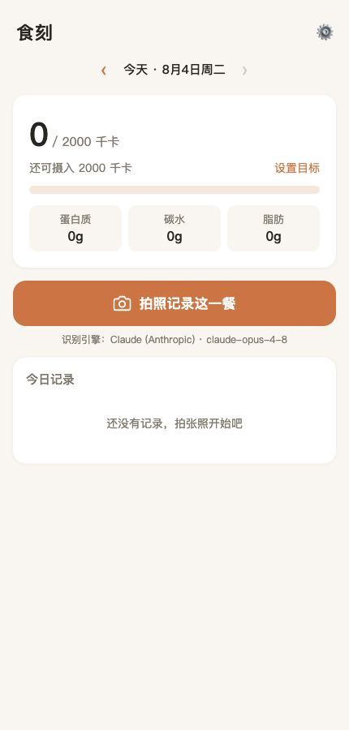

<div align="center">

# 食刻 · Shike

**拍一张，记一餐。用视觉模型把食物照片变成可追踪的热量与营养记录。**




</div>

食刻是一款 Android 食物记录 App。拍摄食物照片后，App 会调用你选择的视觉模型，估算食物份量、热量和三大营养素，并将结果保存在设备本地。

> [!IMPORTANT]
> 食刻用于辅助记录，不替代医疗或专业营养建议。估算结果会受拍摄角度、遮挡和模型能力影响。

## 功能

- 拍照或从相册选择食物图片；
- 识别食物、份量、热量、蛋白质、碳水和脂肪；
- 按日期查看、补记和删除饮食记录；
- 设置每日热量目标并查看进度；
- 支持 Claude、OpenAI、通义千问、智谱 GLM 和自定义 OpenAI 兼容视觉模型；
- 从 `/v1/models` 自动读取当前 API Key 可用的模型，并可在设置页测试连接；
- 记录与 API Key 均保存在 App 本地，不需要账号或自建服务器。

## 架构

```text
public/index.html        Android WebView 界面骨架
public/styles.css        视觉样式
public/app.js            交互、本地状态、图片压缩和记录管理
public/analyze.js        服务商配置、请求校验和模型结果归一化
          │
          └── Capacitor sync ──> android/ 原生 Android 工程
                                      │
                                      └── HTTPS 直连所选模型服务商
```

项目只保留 Android App 路径，没有 Node/Express 服务端，也没有需要部署的 Web 端。模型适配和结果解析只有一份实现，避免 App 与服务端逻辑漂移。

## 开发与运行

需要 Node.js 22+、Android Studio 和可用的 Android SDK/JDK。

```bash
git clone https://github.com/McGeeLee/shike.git
cd shike
npm ci
npm run sync:android
```

用 Android Studio 打开 `android/`，连接设备或启动模拟器后运行。也可以在配置好 JDK 后构建调试包：

```bash
npm run build:android
```

首次使用时，点击右上角设置，选择服务商并填写自己的 API Key。点击“自动获取模型”，从接口返回的列表中选择支持图片输入的模型；“测试连接”只读取模型列表，不上传照片，也不会发起一次识别请求。

## 验证

```bash
npm run check
```

检查包含 JavaScript 语法、模型发现、模型响应容错、HTTPS 地址校验、服务商请求结构，以及纯 App 架构回归测试。GitHub Actions 会在 Pull Request 上执行同一组检查。

## 隐私与安全

- 饮食记录、目标和 API Key 存在 Android WebView 的本地存储中；卸载 App 或清除数据会删除它们。
- 食物照片会经过压缩，然后直接发送给你选择的模型服务商；项目本身不保存或中转照片。
- 自定义接口必须使用 HTTPS，避免在传输中泄露 API Key 和照片。
- 用户备注与模型返回内容在展示前会转义，图片和模型响应也会经过格式与大小校验。
- 不要把真实 API Key 提交到 Git、写入源码或发在截图中。

## 后续方向

- 增加记录编辑、导出与可选备份；
- 增加固定图片回归集，比较不同视觉模型的估算稳定性；
- 评估 Android Keystore 支持，进一步加强本地密钥保护。
